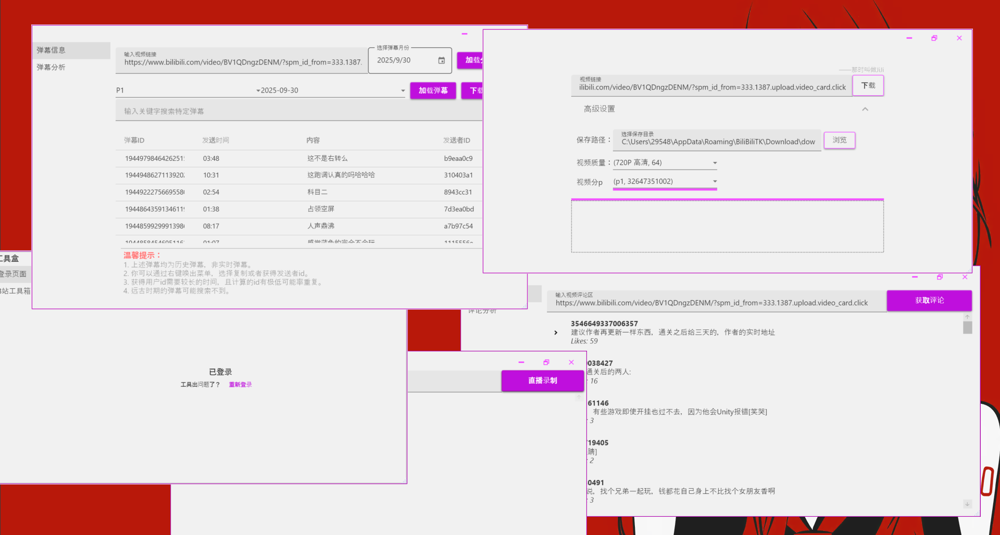

## SenTooliKit

一个基于 .NET 8 与 WPF 的桌面工具箱，聚焦于哔哩哔哩相关数据处理与常用效率工具的集合。项目采用 MVVM（CommunityToolkit.Mvvm）架构，内置数据分析与可视化能力，支持评论、弹幕解析与分析、视频与直播流信息查看等功能。

- 仓库地址：[`https://github.com/NFC666/SenToolkit`](https://github.com/NFC666/SenToolkit.git)


### 功能特性

- 哔哩哔哩工具集（BilibiliPages）
  - 评论信息查询与导出（`BCommentInfoUserControl`）
  - 评论文本分析（分词、词频、停用词过滤）（`BCommentAnalysisUserControl`）
  - 弹幕信息查询与导出（`BDmInfoUserControl`）
  - 弹幕内容分析与可视化（`BDmAnalysisUserControl`）
  - 视频信息查看（`BVideoWindow`）与直播流信息查看（`BStreamWindow`）
- 文本分词与关键词抽取：内置 `jieba.NET` 与自带停用词表（`Resources/stopwords.txt`）
- 数据可视化：基于 `ScottPlot.WPF` 快速绘制统计图表
- Excel 文档导出：`DocumentFormat.OpenXml`
- DI/宿主：`Microsoft.Extensions.DependencyInjection` 与 `Microsoft.Extensions.Hosting`
- UI 样式：`MaterialDesignThemes`、`Microsoft.Xaml.Behaviors.Wpf`


### 技术栈

- 平台：.NET 8（`net8.0-windows`）
- 框架：WPF（桌面 WinExe）
- 架构：MVVM（CommunityToolkit.Mvvm）
- 可视化：ScottPlot.WPF
- 文档处理：DocumentFormat.OpenXml
- 其他：Newtonsoft.Json、Ookii.Dialogs.Wpf、jieba.NET


### 目录结构

```
SenTooliKit.sln
├─ SenTooliKit/                 // WPF 前端（启动项目）
│  ├─ Views/BilibiliPages/      // 哔哩哔哩相关页面与窗口
│  ├─ ViewModels/BilibiliPages/ // 对应的 ViewModel
│  ├─ Resources/                // 图标、停用词等资源
│  └─ App.xaml / MainWindow.xaml
├─ SenTooliKit.Common/          // 通用模型、Helper、Proto 定义等
├─ SenTooliKit.Services/        // 业务逻辑与服务实现
├─ SenTooliKit.IServices/       // 服务接口定义
├─ SenTooliKit.Repository/      // 数据访问/工厂等（如需）
└─ SenTooliKit.Tests/           // 单元测试（xUnit）
```


### 环境要求

- Windows 10/11
- .NET SDK 8.0+
- Visual Studio 2022（推荐）或 Rider


### 本地运行

1) 克隆仓库

```bash
git clone https://github.com/NFC666/SenToolkit.git
cd SenTooliKit
```

2) 还原并构建

```bash
dotnet restore
dotnet build -c Debug
```

3) 启动应用（WPF）

```bash
dotnet run --project SenTooliKit/SenTooliKit.csproj
```


### 发布打包

使用 .NET 发布（推荐 x64）：

```bash
dotnet publish SenTooliKit/SenTooliKit.csproj -c Release -r win-x64 --self-contained false -p:PublishSingleFile=false
```

输出目录位于：`SenTooliKit/bin/Release/net8.0-windows/win-x64/publish/`。

仓库还包含 `SenTooliKit/Releases/` 下的历史产物（如 `RELEASES`、安装包与压缩包），可作为参考。


### 测试

```bash
dotnet test
```


### 常见问题（FAQ）

- 无法运行，提示缺少 .NET：请先安装 .NET 8 运行时/SDK。
- 字体或界面异常：请确认 Windows 具备中文字体并在 100%/125% 缩放下尝试。
- 控件不显示或样式错乱：确保未启用单文件发布调试，或参考项目内注释调整发布参数。


### 贡献与开发

欢迎提交 PR 与 Issue。代码风格与依赖由中央包管理控制：见 `Directory.Packages.props` 与根目录 `.editorconfig`。

建议：

- 保持 MVVM 分层清晰：`Views`、`ViewModels`、`Services`、`Common`
- 引入新依赖时使用中央包管理（不会在项目文件内写死版本）
- 添加/更新测试覆盖核心逻辑


### 许可

本项目采用 Creative Commons Attribution-NonCommercial 4.0 International（CC BY-NC 4.0，署名-非商业性使用）授权。

- 简述：在非商业用途下，允许自由分享与改编本项目，必须保留署名并注明修改，不得用于商业用途，且不得施加额外限制。
- 协议全文：CC BY-NC 4.0（建议阅读官方条款，并在再分发时附上协议链接）。

允许 / 必须 / 禁止（简表）：

| 允许 | 必须 | 禁止 |
| --- | --- | --- |
| 复制、分发、展示、表演作品 | 署名原作者并附上许可链接 | 任何商业用途 |
| 改编、翻译、二次创作 | 如有修改需注明已作出修改 | 对他人施加额外法律或技术限制（如 DRM） |
| 以相同许可再分发 | 明确声明作品基于 CC BY-NC 4.0 授权 | 暗示作者/许可方背书或认可 |

注意：本协议不授予专利、商标、隐私、肖像等其他权利；作品按“现状”提供，作者与许可方不对使用造成的损失负责。若违反条款，授权将自动终止；在 30 天内纠正违规行为则可自动恢复。


### 致谢

- 在哔哩哔哩 API 资料方面参考了 `SocialSisterYi/bilibili-API-collect` 项目，特此致谢。
- `CommunityToolkit.Mvvm`、`ScottPlot.WPF`、`jieba.NET`、`DocumentFormat.OpenXml`、`MaterialDesignThemes` 等开源项目


—— 如果本项目对你有帮助，欢迎 Star 支持：[`NFC666/SenToolkit`](https://github.com/NFC666/SenToolkit.git)


